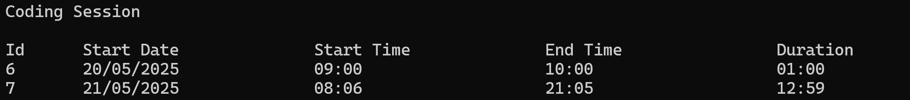

# Coding Tracker

A simple console-based application to track your coding sessions. This project uses SQLite for data storage and Dapper for database interaction. It allows you to log, view, update, and delete your coding sessions with ease.

## Features

- **Insert Coding Sessions**: Log the start and end times of your coding sessions.
- **View Coding Sessions**: Display all recorded sessions, including their duration.
- **Update Coding Sessions**: Modify existing session details.
- **Delete Coding Sessions**: Remove sessions by their unique ID.

## Technologies Used

- **.NET 9.0**
- **C# 13.0**
- **SQLite** (via `System.Data.SQLite`)
- **Dapper** (for lightweight ORM functionality)
- **Microsoft.Extensions.Configuration** (for configuration management)
- **Spectre.Console** (for enhanced console output)

## Prerequisites

- .NET 9.0 SDK installed on your machine.

## Setup Instructions

1. Clone the repository:
   
```shell
   git clone https://github.com/your-username/CodingTracker.git
   cd CodingTracker
   
```

2. Open the project in Visual Studio 2022.

3. Ensure the `appsettings.json` file is configured with the correct SQLite connection string:
   
```json
   {
     "ConnectionStrings": {
       "DefaultConnection": "Data Source=coding_tracker.db"
     }
   }
   
```

4. Build and run the project.

## Usage

1. When you run the application, you will be presented with a menu:
   
```
   Hello, Welcome to the Coding Tracker app!
   Please choose an option from below

   i - to insert an entry
   r - to remove an entry
   u - to update an entry
   v - to view entries
   e - to exit

   Your option:
   
```

2. Choose an option by entering the corresponding letter:
   - **`i`**: Insert a new coding session.
   - **`r`**: Remove an existing session by its ID.
   - **`u`**: Update an existing session by its ID.
   - **`v`**: View all recorded sessions.
   - **`e`**: Exit the application.

3. Follow the prompts to input the required data (e.g., date, start time, end time).

4. View your coding sessions in a tabular format, including their duration.

## Project Structure

- **`CodingTrackerRepository.cs`**: Handles database operations (CRUD).
- **`CodingTrackerController.cs`**: Manages user input and application logic.
- **`ConfigurationManager.cs`**: Reads configuration settings from `appsettings.json`.
- **`CodingTrackerConstants.cs`**: Defines constants for date and time formats.
- **`appsettings.json`**: Stores the SQLite connection string.

## Example Output

When viewing coding sessions, the output will look like this:

